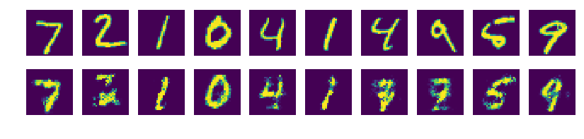

# Lab02 Conditional GAN - (1)

## Simple cGan For MNIST

    # GAN 모델을 이용해 단순히 랜덤한 숫자를 생성하는 아닌,
    # 원하는 손글씨 숫자를 생성하는 모델을 만들어봅니다.
    # 이런 방식으로 흑백 사진을 컬러로 만든다든가, 또는 선화를 채색한다든가 하는 응용이 가능합니다.
    import tensorflow as tf
    import matplotlib.pyplot as plt
    import numpy as np
    
    from tensorflow.examples.tutorials.mnist import input_data
    mnist = input_data.read_data_sets("./MNIST_data/", one_hot=True)
    
    ##########
    # 옵션 설정
    ##########
    total_epoch = 100
    batch_size = 100
    n_hidden = 256
    n_input = 28 * 28
    n_noise = 128
    n_class = 10
    
    ##########
    # 신경망 모델 구성
    ##########
    X = tf.placeholder(tf.float32, [None, n_input])
    # 노이즈와 실제 이미지에, 그에 해당하는 숫자에 대한 정보를 넣어주기 위해 사용합니다.
    # Y: 클래스 정보를 one-hot 인코딩한 값
    Y = tf.placeholder(tf.float32, [None, n_class])
    Z = tf.placeholder(tf.float32, [None, n_noise])
    
    
    # Generator 신경망
    def generator(noise, labels):
        with tf.variable_scope('generator'):
            # noise 값에 labels 정보를 추가합니다.
            # tf.concat(list, list, axis) 데이터를 횡 방향으로 연결
            # axis에 따라 몇 차원을 기준으로 tensor를 붙일지 달라짐
            # ex) t1 = [[1, 2, 3], [4, 5, 6]]
                  t2 = [[7, 8, 9], [10, 11, 12]]
                  tf.concat([t1, t2], 0) => [[1, 2, 3], [4, 5, 6], [7, 8, 9], [10, 11, 12]]
                  tf.concat([t1, t2], 1) => [[1, 2, 3, 4, 5, 6], [7, 8, 9, 10, 11, 12]]
            inputs = tf.concat([noise, labels], 1)
    
            # TensorFlow 에서 제공하는 유틸리티 함수를 이용해 신경망을 매우 간단하게 구성할 수 있습니다.
            hidden = tf.layers.dense(inputs, n_hidden, activation=tf.nn.relu)
            output = tf.layers.dense(hidden, n_input, activation=tf.nn.sigmoid)
    
        return output
    
    
    # Dscriminator 신경망
    def discriminator(inputs, labels, reuse=None):
        with tf.variable_scope('discriminator') as scope:
            # 노이즈에서 생성한 이미지와 실제 이미지를 판별하는 모델의 변수를 동일하게 하기 위해,
            # 이전에 사용되었던 변수를 재사용하도록 합니다.
            if reuse:
                scope.reuse_variables()
    
            inputs = tf.concat([inputs, labels], 1)
    
            hidden = tf.layers.dense(inputs, n_hidden, activation=tf.nn.relu)
            output = tf.layers.dense(hidden, 1, activation=None)
    
        return output
    
    
    # noise를 랜덤하게 생성하는 함수
    def get_noise(batch_size, n_noise):
        # np.random.uniform(min, max, size): size에 맞춰 min과 max 사이 float형 숫자 리턴
        return np.random.uniform(-1., 1., size=[batch_size, n_noise])
    
    
    # Generator과 Discriminator 에 Y 즉, labels 정보를 추가하여
    # labels 정보에 해당하는 이미지를 생성할 수 있도록 유도합니다.
    G = generator(Z, Y)
    D_real = discriminator(X, Y)
    D_gene = discriminator(G, Y, True)
    
    # 손실함수는 다음을 참고하여 GAN 논문에 나온 방식과는 약간 다르게 작성하였습니다.
    # http://bamos.github.io/2016/08/09/deep-completion/
    # 진짜 이미지를 판별하는 D_real 값은 1에 가깝도록,
    # 가짜 이미지를 판별하는 D_gene 값은 0에 가깝도록 하는 손실 함수입니다.
    # tf.ones_like(list): list와 shape는 동일하나, 모두 1로 채워진 배열 반환
    loss_D_real = tf.reduce_mean(
                        tf.nn.sigmoid_cross_entropy_with_logits(
                            logits=D_real, labels=tf.ones_like(D_real)))
    loss_D_gene = tf.reduce_mean(
                        tf.nn.sigmoid_cross_entropy_with_logits(
                            logits=D_gene, labels=tf.zeros_like(D_gene)))
    # loss_D_real 과 loss_D_gene 을 더한 뒤 이 값을 최소화 하도록 최적화합니다.
    # loss_D_real = -log D(x)
    # loss_D_gene = -log(1 - D(G(z)))
    # loss_D = loss_D_real + loss_D_gene = -(log D(x) + log(1 - D(G(z))))
    loss_D = loss_D_real + loss_D_gene
    # 가짜 이미지를 진짜에 가깝게 만들도록 생성망을 학습시키기 위해, D_gene 을 최대한 1에 가깝도록 만드는 손실함수입니다.
    # loss_G = -log D(G(z))
    loss_G = tf.reduce_mean(
                        tf.nn.sigmoid_cross_entropy_with_logits(
                            logits=D_gene, labels=tf.ones_like(D_gene)))
    
    # TensorFlow 에서 제공하는 유틸리티 함수를 이용해
    # discriminator 와 generator scope 에서 사용된 변수들을 쉽게 가져올 수 있습니다.
    # get_collection(key, scope): 해당 키와 scope를 참조하여 명명된 값들의 집합을 가져옴
    vars_D = tf.get_collection(tf.GraphKeys.TRAINABLE_VARIABLES, scope='discriminator')
    vars_G = tf.get_collection(tf.GraphKeys.TRAINABLE_VARIABLES, scope='generator')
    
    # loss_D와 loss_G는 논문에서 제시한 기존 공식과 비교하여 부호가 반대이므로 minimize하여도 괜찮음
    train_D = tf.train.AdamOptimizer().minimize(loss_D, var_list=vars_D)
    train_G = tf.train.AdamOptimizer().minimize(loss_G, var_list=vars_G)
    
    ##########
    # 신경망 모델 학습
    ##########
    sess = tf.Session()
    sess.run(tf.global_variables_initializer())
    
    total_batch = int(mnist.train.num_examples/batch_size)
    loss_val_D, loss_val_G = 0, 0
    
    for epoch in range(total_epoch):
        for i in range(total_batch):
            batch_xs, batch_ys = mnist.train.next_batch(batch_size)
            noise = get_noise(batch_size, n_noise)
    
            _, loss_val_D = sess.run([train_D, loss_D],
                                     feed_dict={X: batch_xs, Y: batch_ys, Z: noise})
            _, loss_val_G = sess.run([train_G, loss_G],
                                     feed_dict={Y: batch_ys, Z: noise})
    
        print('Epoch:', '%04d' % epoch,
              'D loss: {:.4}'.format(loss_val_D),
              'G loss: {:.4}'.format(loss_val_G))
    
        ##########
        # 학습이 되어가는 모습을 보기 위해 주기적으로 레이블에 따른 이미지를 생성하여 저장
        ##########
        # sess.run()함수 호출 부분에서 mnist.test.labels[:sample_size]의 추출 범위를 달리하면
        # 다른 결과를 볼 수 있음
        # ex) samples = sess.run(G,
                                 feed_dict={Y: mnist.test.labels[10:sample_size+10],
                                            Z: noise})
        # 단, 하단 ax[0]의 출력 test image의 범위 역시 추출범위와 동일하도록 수정해야 함
        # ex) ax[0][i].imshow(np.reshape(mnist.test.images[i+10], (28, 28)))
        if epoch == 0 or (epoch + 1) % 10 == 0:
            sample_size = 10
            noise = get_noise(sample_size, n_noise)
            samples = sess.run(G,
                               feed_dict={Y: mnist.test.labels[:sample_size],
                                          Z: noise})
            
            # test 이미지 중에서 0 ~ 9번째 이미지와 얼마나 동일한가 비교
            fig, ax = plt.subplots(2, sample_size, figsize=(sample_size, 2))
    
            for i in range(sample_size):
                ax[0][i].set_axis_off()
                ax[1][i].set_axis_off()
    
                ax[0][i].imshow(np.reshape(mnist.test.images[i], (28, 28)))
                ax[1][i].imshow(np.reshape(samples[i], (28, 28)))
    
            plt.savefig('samples2/{}.png'.format(str(epoch).zfill(3)), bbox_inches='tight')
            plt.close(fig)
    
    print('최적화 완료!')
    
[return]

Epoch: 0000 D loss: 0.01123 G loss: 7.063

Epoch: 0001 D loss: 0.01791 G loss: 6.086

Epoch: 0002 D loss: 0.02314 G loss: 7.185

. . .

Epoch: 0097 D loss: 0.5903 G loss: 2.316

Epoch: 0098 D loss: 0.8938 G loss: 2.174

Epoch: 0099 D loss: 0.7534 G loss: 2.025

최적화 완료!

## 샘플 이미지

    
## 출처

- 서적: 골빈 해커의 3분 딥러닝
- 코드: https://github.com/golbin/TensorFlow-Tutorials/blob/master/09%20-%20GAN/02%20-%20GAN2.py